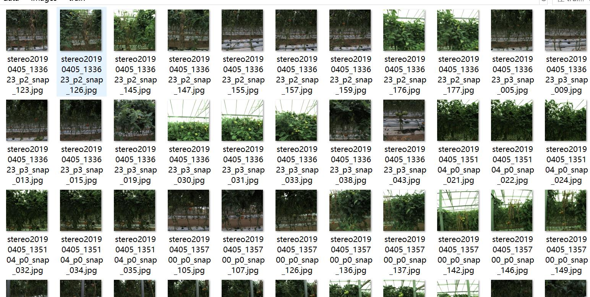
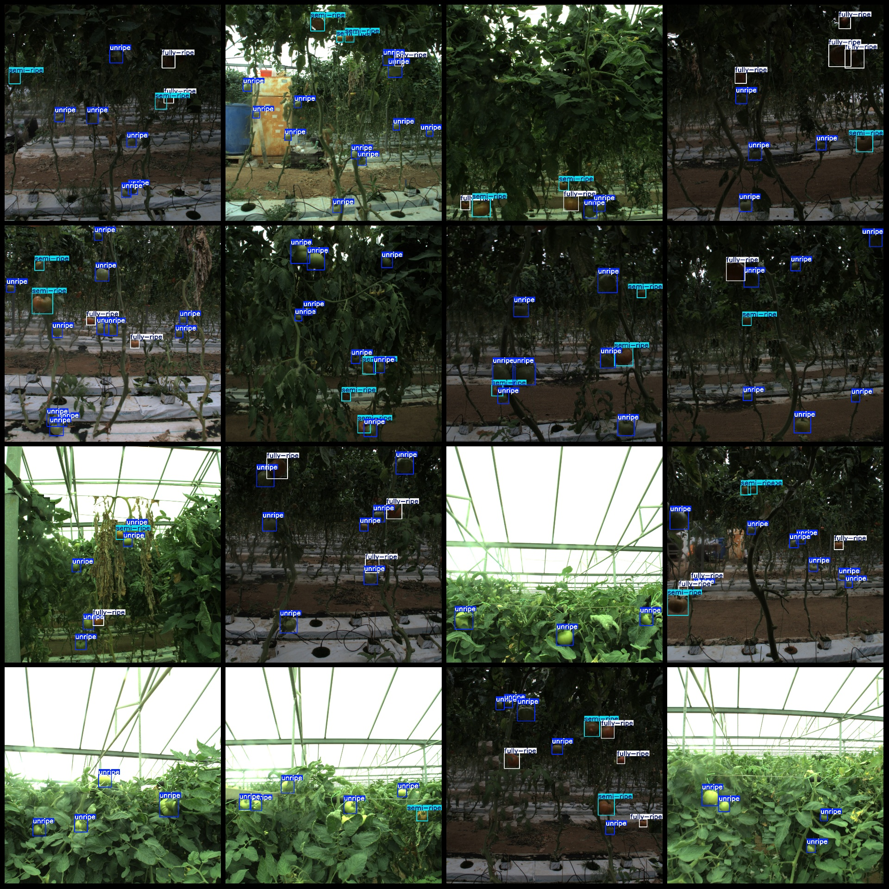

# 基于yolov11的大棚番茄成熟度检测系统python源码+pytorch模型+评估指标曲线+精美GUI界面

【算法介绍】

在农业大棚种植朝着智能化、精细化方向加速发展的关键时期，精准且高效地监测大棚番茄的成熟度状态，已然成为保障种植效益、提升农产品品质以及优化采摘计划的核心挑战之一。大棚环境复杂多变，番茄植株生长状态丰富多样，像不同生长阶段的叶片形态、果实大小变化以及果实所处的不同位置等，这些状态不仅直观反映了番茄当下的生长健康状况，更与种植户的整体收益、市场供应的稳定性等紧密相连。一旦番茄出现成熟度异常情况，如部分果实过早成熟、过晚成熟或者出现病害导致成熟度不均等，若未能及时察觉并采取相应措施，极易引发果实腐烂、品质下降甚至影响整个大棚的产量，给种植户带来巨大的经济损失。

传统大棚番茄成熟度检测方式主要依赖人工巡查。然而，受种植大棚规模不断扩大、番茄植株数量日益增多以及大棚空间布局复杂等因素限制，人工巡查很难全面覆盖大棚的各个区域，尤其是那些隐藏在植株深处或处于角落位置的番茄状态，往往难以被及时观察到。而且，早期基于简单颜色判定的监测方法，由于番茄品种多样导致颜色表现各异、大棚内光照条件不稳定以及各种枝叶遮挡等因素干扰，误判率高达 30%以上，根本无法满足种植户“精准化、零疏漏”的管理需求。因此，开发一套具备高精度、强适应性且能实时监测的大棚番茄成熟度智能检测系统，成为提升种植管理水平和种植效益的关键技术突破点。

目前现有技术存在诸多明显瓶颈：人工巡查不仅效率极其低下（单人单日仅能完成有限数量番茄植株的观察），而且巡查人员还面临着被枝叶划伤、长时间工作导致观察疲劳等风险；基于简单颜色和形状分割的传统算法，难以准确区分番茄的正常成熟状态与异常成熟状态（例如，番茄正常成熟时的色泽变化与因病害导致的色泽异常），在光线昏暗、大棚内水汽弥漫等低能见度环境下，算法性能会急剧下降；传统目标检测模型对番茄生长的多样性（如不同生长阶段的大小变化、不同品种的形态差异）和尺度变化（从幼果的小巧到成熟果实的饱满）适应性较差，对于小目标（如刚结果的小番茄）的成熟度漏检率超过 40%，难以满足实际种植场景的复杂需求。

基于 YOLOv11 的大棚番茄成熟度检测系统为农业种植管理带来了革命性的变革。YOLOv11 作为先进的目标检测算法，具备强大的特征提取和实时检测能力。该系统充分发挥 YOLOv11 的端到端实时检测优势，并针对大棚复杂环境进行了深度优化。

此系统能够精准识别番茄的成熟度类别，具体涵盖：

- unripe（未成熟）：准确捕捉番茄处于未成熟阶段的形态特征，如颜色青绿、果实较硬等，帮助种植户了解番茄生长进度，合理安排后续管理措施。

- semi - ripe（半成熟）：实时监测番茄半成熟时的状态，此时番茄颜色开始转变，质地也有所变化，系统能精准判断，为种植户确定最佳采摘前期准备时间提供依据。

- fully - ripe（完全成熟）：敏锐识别番茄完全成熟时的特征，如色泽鲜艳、果实饱满且具有一定弹性等，确保种植户能在番茄品质最佳时进行采摘，提高农产品的市场价值。

通过对大量番茄成熟度图像数据的学习和训练，系统能够保持较高的检测准确率。同时，系统具备强大的抗干扰能力，能够有效应对大棚内枝叶、支架等干扰因素，为新型智能化种植大棚建设提供了坚实的技术支撑，助力种植户实现高效、精准、科学的种植管理。

【效果展示】

<div style="text-align:center;"></div>

<div style="text-align:center;">&nbsp;</div>

【测试环境】

windows10
anaconda3+python3.8
torch==2.3.1
ultralytics==8.3.81

【模型可以检测出类别】

unripe
semi-ripe
fully-ripe

【训练数据集介绍】

数据集格式：YOLO格式(不包含分割路径的txt文件，仅仅包含jpg图片以及yolo格式txt文件)

图片数量(jpg文件个数)：279

标注数量(xml文件个数)：279

标注数量(txt文件个数)：279

标注类别数：3

所在仓库：firc-dataset

标注类别名称(注意yolo格式类别顺序不和这个对应，而以labels文件夹classes.txt为准):["unripe","semi-ripe","fully-ripe"]

每个类别标注的框数：

unripe 框数 = 1593

semi-ripe 框数 = 397

fully-ripe 框数 = 431

总框数：2421

使用标注工具：labelImg

标注规则：对类别进行画矩形框

重要说明：暂无

特别声明：本数据集不对训练的模型或者权重文件精度作任何保证，数据集只提供准确且合理标注

图片预览：



标注例子：



【训练信息】

| 参数 | 值 |
|:---:|:---:|
| 训练集图片数 | 263 |
| 验证集图片数 | 14 |
| 训练map | 87.8% |
| 训练精度(Precision) | 80.3% |
| 训练召回率(Recall) | 87.6% |

【验证集精度统计】

| Class | Images | Instances | P | R | mAP50 | mAP50-95 |
|:---:|:---:|:---:|:---:|:---:|:---:|:---:|
| all | 14 | 103 | 0.803 | 0.876 | 0.878 | 0.59 |
| unripe | 13 | 64 | 0.866 | 0.984 | 0.967 | 0.619 |
| semi-ripe | 8 | 17 | 0.63 | 0.703 | 0.725 | 0.514 |
| fully-ripe | 11 | 22 | 0.912 | 0.942 | 0.942 | 0.636 |

【界面设计】

```
class Ui_MainWindow(QtWidgets.QMainWindow):
    signal = QtCore.pyqtSignal(str, str)
 
    def setupUi(self):
        self.setObjectName("MainWindow")
        self.resize(1280, 728)
        self.centralwidget = QtWidgets.QWidget(self)
        self.centralwidget.setObjectName("centralwidget")
 
        self.weights_dir = './weights'
 
        self.picture = QtWidgets.QLabel(self.centralwidget)
        self.picture.setGeometry(QtCore.QRect(260, 10, 1010, 630))
        self.picture.setStyleSheet("background:black")
        self.picture.setObjectName("picture")
        self.picture.setScaledContents(True)
        self.label_2 = QtWidgets.QLabel(self.centralwidget)
        self.label_2.setGeometry(QtCore.QRect(10, 10, 81, 21))
        self.label_2.setObjectName("label_2")
        self.cb_weights = QtWidgets.QComboBox(self.centralwidget)
        self.cb_weights.setGeometry(QtCore.QRect(10, 40, 241, 21))
        self.cb_weights.setObjectName("cb_weights")
        self.cb_weights.currentIndexChanged.connect(self.cb_weights_changed)
 
        self.label_3 = QtWidgets.QLabel(self.centralwidget)
        self.label_3.setGeometry(QtCore.QRect(10, 70, 72, 21))
        self.label_3.setObjectName("label_3")
        self.hs_conf = QtWidgets.QSlider(self.centralwidget)
        self.hs_conf.setGeometry(QtCore.QRect(10, 100, 181, 22))
        self.hs_conf.setProperty("value", 25)
        self.hs_conf.setOrientation(QtCore.Qt.Horizontal)
        self.hs_conf.setObjectName("hs_conf")
        self.hs_conf.valueChanged.connect(self.conf_change)
        self.dsb_conf = QtWidgets.QDoubleSpinBox(self.centralwidget)
        self.dsb_conf.setGeometry(QtCore.QRect(200, 100, 51, 22))
        self.dsb_conf.setMaximum(1.0)
        self.dsb_conf.setSingleStep(0.01)
        self.dsb_conf.setProperty("value", 0.25)
        self.dsb_conf.setObjectName("dsb_conf")
        self.dsb_conf.valueChanged.connect(self.dsb_conf_change)
        self.dsb_iou = QtWidgets.QDoubleSpinBox(self.centralwidget)
        self.dsb_iou.setGeometry(QtCore.QRect(200, 160, 51, 22))
        self.dsb_iou.setMaximum(1.0)
        self.dsb_iou.setSingleStep(0.01)
        self.dsb_iou.setProperty("value", 0.45)
        self.dsb_iou.setObjectName("dsb_iou")
        self.dsb_iou.valueChanged.connect(self.dsb_iou_change)
        self.hs_iou = QtWidgets.QSlider(self.centralwidget)
        self.hs_iou.setGeometry(QtCore.QRect(10, 160, 181, 22))
        self.hs_iou.setProperty("value", 45)
        self.hs_iou.setOrientation(QtCore.Qt.Horizontal)
        self.hs_iou.setObjectName("hs_iou")
        self.hs_iou.valueChanged.connect(self.iou_change)
        self.label_4 = QtWidgets.QLabel(self.centralwidget)
        self.label_4.setGeometry(QtCore.QRect(10, 130, 72, 21))
        self.label_4.setObjectName("label_4")
        self.label_5 = QtWidgets.QLabel(self.centralwidget)
        self.label_5.setGeometry(QtCore.QRect(10, 210, 72, 21))
        self.label_5.setObjectName("label_5")
        self.le_res = QtWidgets.QTextEdit(self.centralwidget)
        self.le_res.setGeometry(QtCore.QRect(10, 240, 241, 400))
        self.le_res.setObjectName("le_res")
        self.setCentralWidget(self.centralwidget)
        self.menubar = QtWidgets.QMenuBar(self)
        self.menubar.setGeometry(QtCore.QRect(0, 0, 1110, 30))
        self.menubar.setObjectName("menubar")
        self.setMenuBar(self.menubar)
        self.statusbar = QtWidgets.QStatusBar(self)
        self.statusbar.setObjectName("statusbar")
        self.setStatusBar(self.statusbar)
        self.toolBar = QtWidgets.QToolBar(self)
        self.toolBar.setToolButtonStyle(QtCore.Qt.ToolButtonTextBesideIcon)
        self.toolBar.setObjectName("toolBar")
        self.addToolBar(QtCore.Qt.TopToolBarArea, self.toolBar)
        self.actionopenpic = QtWidgets.QAction(self)
        icon = QtGui.QIcon()
        icon.addPixmap(QtGui.QPixmap(":/images/1.png"), QtGui.QIcon.Normal, QtGui.QIcon.Off)
        self.actionopenpic.setIcon(icon)
        self.actionopenpic.setObjectName("actionopenpic")
        self.actionopenpic.triggered.connect(self.open_image)
        self.action = QtWidgets.QAction(self)
        icon1 = QtGui.QIcon()
        icon1.addPixmap(QtGui.QPixmap(":/images/2.png"), QtGui.QIcon.Normal, QtGui.QIcon.Off)
        self.action.setIcon(icon1)
        self.action.setObjectName("action")
        self.action.triggered.connect(self.open_video)
        self.action_2 = QtWidgets.QAction(self)
        icon2 = QtGui.QIcon()
        icon2.addPixmap(QtGui.QPixmap(":/images/3.png"), QtGui.QIcon.Normal, QtGui.QIcon.Off)
        self.action_2.setIcon(icon2)
        self.action_2.setObjectName("action_2")
        self.action_2.triggered.connect(self.open_camera)
 
        self.actionexit = QtWidgets.QAction(self)
        icon3 = QtGui.QIcon()
        icon3.addPixmap(QtGui.QPixmap(":/images/4.png"), QtGui.QIcon.Normal, QtGui.QIcon.Off)
        self.actionexit.setIcon(icon3)
        self.actionexit.setObjectName("actionexit")
        self.actionexit.triggered.connect(self.exit)
 
        self.toolBar.addAction(self.actionopenpic)
        self.toolBar.addAction(self.action)
        self.toolBar.addAction(self.action_2)
        self.toolBar.addAction(self.actionexit)
 
        self.retranslateUi()
        QtCore.QMetaObject.connectSlotsByName(self)
        self.init_all()
```

【常用评估参数介绍】

在目标检测任务中，评估模型的性能是至关重要的。你提到的几个术语是评估模型性能的常用指标。下面是对这些术语的详细解释：

Class：
这通常指的是模型被设计用来检测的目标类别。例如，一个模型可能被训练来检测车辆、行人或动物等不同类别的对象。
Images：
表示验证集中的图片数量。验证集是用来评估模型性能的数据集，与训练集分开，以确保评估结果的公正性。
Instances：
在所有图片中目标对象的总数。这包括了所有类别对象的总和，例如，如果验证集包含100张图片，每张图片平均有5个目标对象，则Instances为500。
P（精确度Precision）：
精确度是模型预测为正样本的实例中，真正为正样本的比例。计算公式为：Precision = TP / (TP + FP)，其中TP表示真正例（True Positives），FP表示假正例（False Positives）。
R（召回率Recall）：
召回率是所有真正的正样本中被模型正确预测为正样本的比例。计算公式为：Recall = TP / (TP + FN)，其中FN表示假负例（False Negatives）。
mAP50：
表示在IoU（交并比）阈值为0.5时的平均精度（mean Average Precision）。IoU是衡量预测框和真实框重叠程度的指标。mAP是一个综合指标，考虑了精确度和召回率，用于评估模型在不同召回率水平上的性能。在IoU=0.5时，如果预测框与真实框的重叠程度达到或超过50%，则认为该预测是正确的。
mAP50-95：
表示在IoU从0.5到0.95（间隔0.05）的范围内，模型的平均精度。这是一个更严格的评估标准，要求预测框与真实框的重叠程度更高。在目标检测任务中，更高的IoU阈值意味着模型需要更准确地定位目标对象。mAP50-95的计算考虑了从宽松到严格的多个IoU阈值，因此能够更全面地评估模型的性能。
这些指标共同构成了评估目标检测模型性能的重要框架。通过比较不同模型在这些指标上的表现，可以判断哪个模型在实际应用中可能更有效。

【使用步骤】

使用步骤：
（1）首先根据官方框架ultralytics安装教程安装好yolov11环境，并安装好pyqt5
（2）切换到自己安装的yolo11环境后，并切换到源码目录，执行python main.py即可运行启动界面，进行相应的操作即可

【提供文件】

python源码
yolo11n.pt模型
训练的map,P,R曲线图(在weights\results.png)
测试图片（在test_img文件夹下面）

注意提供训练的数据集，请到mytxt.txt文件中找到地址
<br>项目源码地址：https://mbd.pub/o/bread/YZWVk5hpZw==
